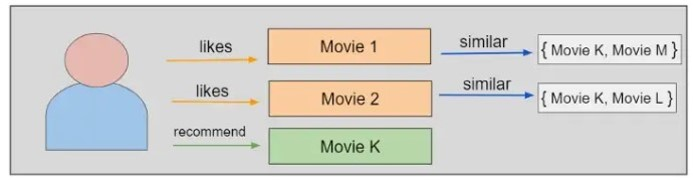
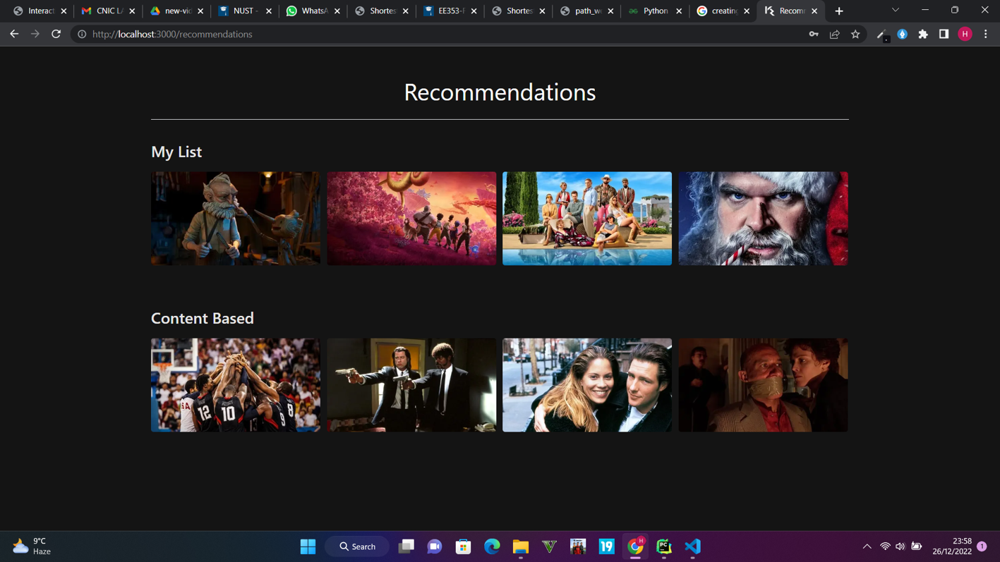
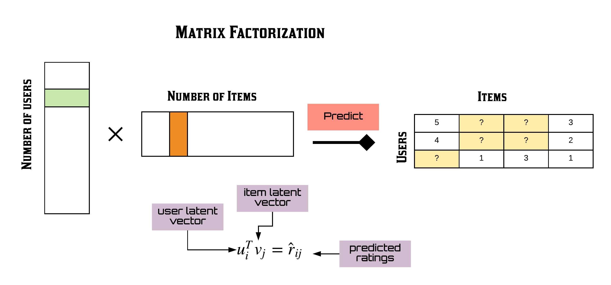
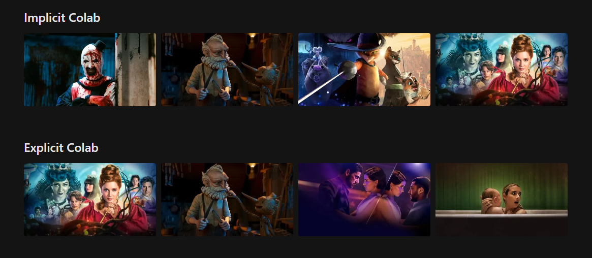
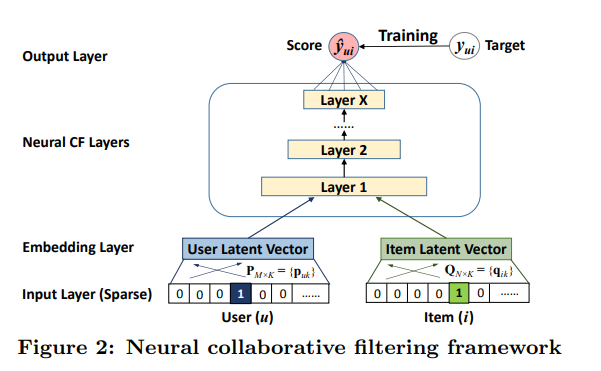
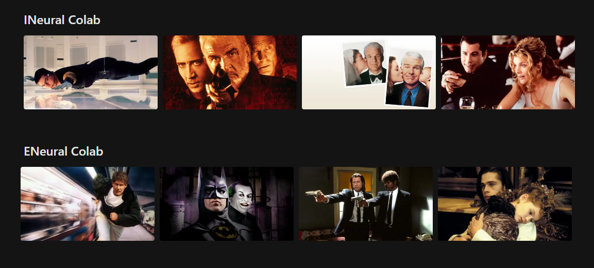
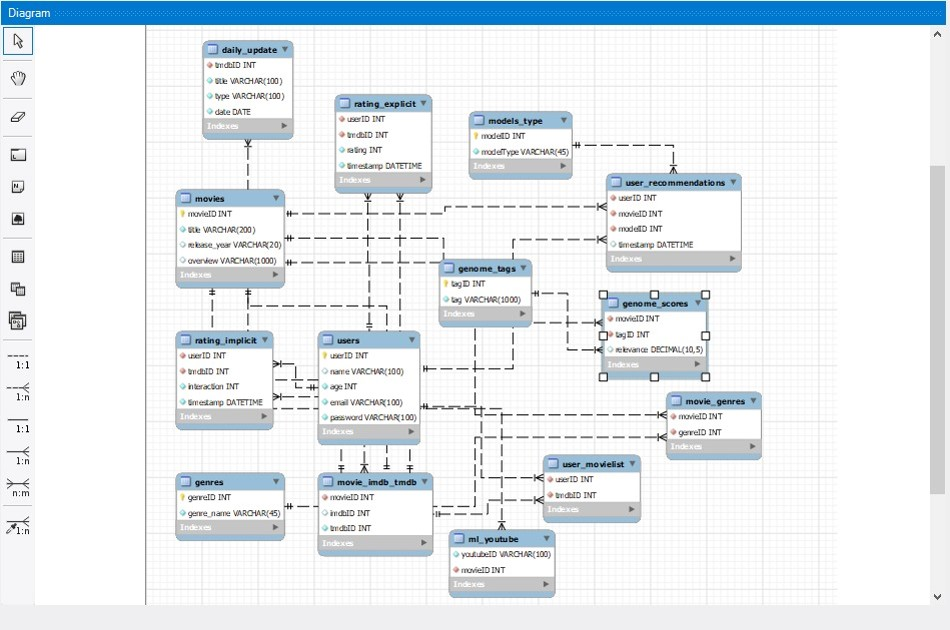

## End to End Recommendation System
This repo contains a Recommendation system built with NextJS, Flask, MySQL, TailwindCSS and AWS. 

Refer to my Medium blog on [One-Stop Guide for Production Recommendation Systems](https://medium.com/@zaiinn440/one-stop-guide-for-production-recommendation-systems-9491f68d92e3). I will be incorporating the learnings from the architectures and approaches of Instagra, Alibaba, and Uber.


## Table of Contents
  * [What are Recommendation systems?](#what-are-recommendation-system)
  * [Content based Recommendations](#content-based)
  * [Collaborative Filtering](#collaborative)
  * [Neural Collaborative Filtering](#neural-collaborative)
  * [Database](#database)
  * [Connect with me](#connect-with-me)

 
## What are Recommendation systems?
Recommendation systems are algorithms and techniques designed to suggest or recommend items, products, or content to users based on their preferences, behavior, or past interactions. These systems analyze user data, such as purchase history, ratings, or browsing patterns, and use it to generate personalized recommendations. The goal is to provide users with relevant and tailored suggestions to enhance their experience and help them discover new items of interest. Recommendation systems are commonly used in various domains, including e-commerce, streaming platforms, social media, and online content platforms, to assist users in finding products, movies, music, articles, or other items that match their individual preferences.

## Content based Recommendations
Content-based recommenders are a type of recommendation system that suggests items based on their inherent characteristics or content. These systems analyze the properties, features, or attributes of items and match them to user preferences. The recommender identifies patterns and correlations between user profiles and item attributes, such as genre, keywords, or metadata, to make recommendations. By understanding user preferences through past interactions or explicit feedback, the system selects items that have similar content to the ones the user has shown interest in. Content-based recommenders are effective in domains where item attributes play a significant role, such as recommending movies based on genre preferences or suggesting articles based on topic similarity.


<p align="center">

</p>

Customizable personal list of movies. This list is used to create content based recommendations. This also solves the cold start problem of recommenders.

<p align="center">

</p>

## Collaborative Filtering
Collaborative filtering recommenders are a type of recommendation system that suggests items based on the preferences and behaviors of similar users. These systems leverage the collective wisdom of a user community to make recommendations. By analyzing user-item interaction data, such as ratings, reviews, or purchase history, the recommender identifies users with similar tastes and preferences. It then recommends items that have been positively received by those similar users but have not yet been experienced by the target user. Collaborative filtering can be implemented using either user-based or item-based approaches, both of which utilize the concept of similarity to make personalized recommendations.

<p align="center">

</p>

Movie recommendations from MF collaborative filtering u2i.

<p align="center">

</p>

## Neural Collaborative Filtering
Neural collaborative filtering (NCF) recommenders are a type of recommendation system that combines the power of neural networks with collaborative filtering techniques. NCF models leverage deep learning architectures to learn complex patterns and interactions between users and items. By representing users and items as high-dimensional embeddings, NCF models can capture latent features and relationships in the data. These models employ neural networks, such as multi-layer perceptrons (MLPs) or deep autoencoders, to learn the user-item interaction patterns and make personalized recommendations. NCF recommenders are known for their ability to handle sparse and implicit feedback data and have demonstrated improved performance in terms of accuracy and recommendation quality compared to traditional collaborative filtering methods.

<p align="center">

</p>

Movie recommendations from neural collaborative filtering.

<p align="center">

</p>

## Database

The `Kryptonite` database is designed to manage various aspects of a movie recommendation system, incorporating user interactions, movie details, and machine learning model information. The schema comprises several interconnected tables, each serving a specific purpose. The core tables include "movies," storing movie details; "users," storing user information; and "movie_imdb_tmdb," mapping movies to IMDb and TMDb IDs. The "genres" table categorizes movies into genres, and "movie_genres" establishes a many-to-many relationship between movies and genres.

User interactions with movies are tracked through the `rating_explicit` and `rating_implicit` tables, capturing explicit and implicit user ratings, respectively. The "user_movielist" table records movies added to a user's list. The "genome_scores" and "genome_tags" tables store genome scores representing the relevance of tags to movies. YouTube-related data is managed in the "ml_youtube" table, linking YouTube IDs to movie IDs. Additionally, the "daily_update" table tracks daily updates related to movies.

Machine learning models used in the recommendation system are categorized in the "models_type" table. The `user_recommendations` table maintains records of movie recommendations generated by specific models for individual users. Foreign key constraints are employed to ensure data integrity, and CASCADE ON DELETE is applied to maintain referential integrity when records in referenced tables are deleted.

<p align="center">

</p>

In terms of `views`, the "content_based_view" combines data from "user_movielist," "movie_imdb_tmdb," "movies," "movie_genres," and "genres" to provide a comprehensive view of a user's movie list with associated genres. The "train_content_data" view extracts relevant movie details for training content-based recommendation models.

The "Kryptonite" database encompasses movie details, user interactions, machine learning models, and genre information to facilitate a comprehensive movie recommendation system. The relational structure enables efficient data retrieval and maintenance, while the views offer simplified access to relevant information for analysis and model training. The design supports scalability, referential integrity, and diverse interactions within the movie ecosystem.

## Acknowledgements

I found these resources useful (while developing this one):

* [Google's Recommendation systems blogs](https://developers.google.com/machine-learning/recommendation)
* [RecSYS](https://towardsdatascience.com/recommender-systems-a-complete-guide-to-machine-learning-models-96d3f94ea748)
* [Recommendation and Search](https://www.youtube.com/watch?v=Tw4HGtUMF_U&ab_channel=SFBigAnalytics)
* [Content based Recommender](https://www.researchgate.net/publication/236895069_Content-Based_Recommendation_Systems)
* [Implicit and Explicit Collaborative](https://www.researchgate.net/publication/200121027_Collaborative_Filtering_Recommender_Systems)
* [Implicit and Explicit Neural Collaborative](https://arxiv.org/abs/1708.05031) <br/> 


## Citation

If you find this code useful, please cite the following:

```
@misc{Zain2023End2endrecommendationengine,
  author = {Zain, Abideen},
  title = {end2end-recommendation-engine},
  year = {2023},
  publisher = {GitHub},
  journal = {GitHub repository},
  howpublished = {\url{https://github.com/abideenml/End2End-Recommendation-Engine_},
}
```

## Connect with me

If you'd love to have some more AI-related content in your life :nerd_face:, consider:

* Connect and reach me on [LinkedIn](https://www.linkedin.com/in/zaiinulabideen/) and [Twitter](https://twitter.com/zaynismm)
* Follow me on 📚 [Medium](https://medium.com/@zaiinn440)
* Subscribe to my 📢 weekly [AI newsletter](https://rethinkai.substack.com/)!

## Licence

[](https://github.com/abideenml/End2End-Recommendation-Engine_/blob/master/LICENCE)